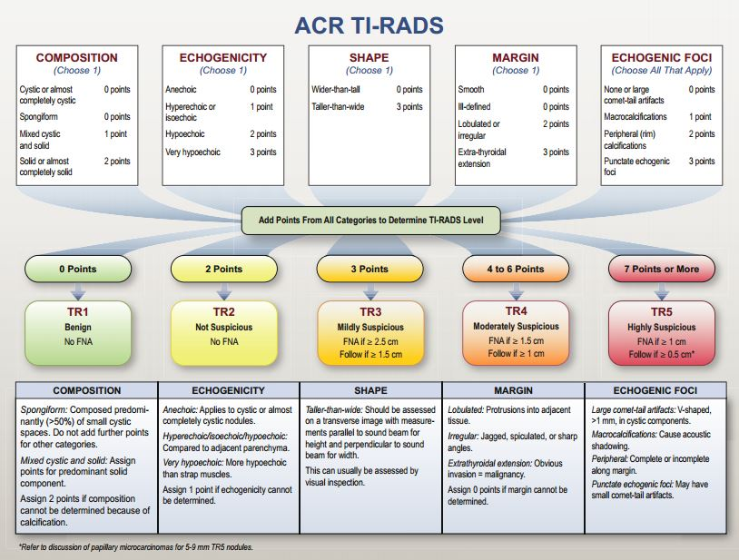
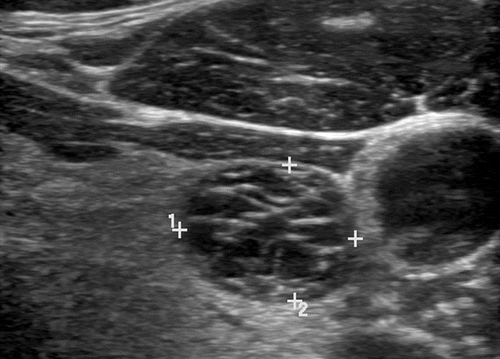
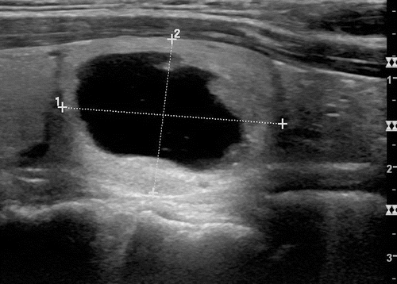
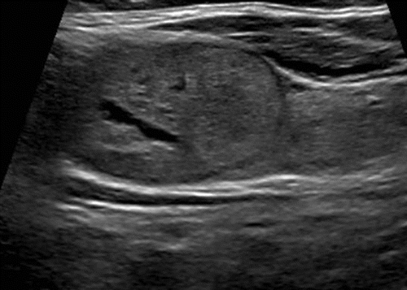
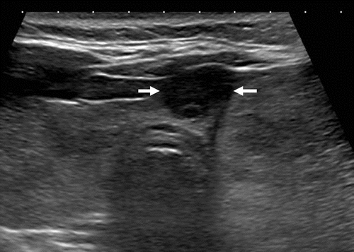

# Towards automated structured reporting of thyroid ultrasound to reduce fine needle aspirations in thyroid cancer

#### Background: 
Thyroid nodules are prevalent among adults, though only a small portion of these nodules are malignant. Ultrasound findings are often not specific enough to classify nodules, therefore definitive diagnosis is made through invasive procedures including fine needle aspiration. Classification systems such as Thyroid Imaging, Reporting, and Data System (TI-RADS) have been suggested to provide risk stratification of thyroid nodules. This work seeks to implement TI-RADS structured reporting in a clinical environment and develop methodology to automate this scoring. 

#### Methods: 
This study has two aims, focusing on process improvement and developing automatic scoring. For the process improvement, a consensus on structured language for TI-RADS was reached and the template is being implemented at the Michigan State University Radiology Clinic. For the automatic scoring, patients receiving thyroid ultrasounds at a tertiary care hospital were recruited into a prospective IRB approved, case-controlled study. Only adult patients able to provide informed consent were included and 165 patients were recruited. Shear-wave elastography (SWE) and B-mode ultrasound images were collected on all thyroid nodules. Deep learning, convolutional neural networks were developed to automatically classify images of nodules as malignant or benign using a supervised learning approach with data labeled with biopsy confirmed malignancy. Pairs of 964 SWE and B-mode images were split into training (n=636), validation (n=159), and test (n=169). The training images were used to fine tune the ResNet-50 classification architecture and a variety of hyperparameter settings were explored. The primary outcome measure was the detection accuracy of the automated method. 

#### Results: 
The automated system could correctly predict malignancy in thyroid nodules within the test set with an accuracy of 88.7% and an area under the curve of 0.914. This classification system provided a test statistic for each lesion, effectively estimating the percent likelihood of malignancy. This statistic could be used to rank nodules in patients with multiple suspicious lesions, providing insight into which nodules to biopsy in multinodular disease. 

#### Conclusion: 
This automated system demonstrated that classification of thyroid nodules as malignant or benign using machine learning is feasible. Future work will perform comparative effectiveness research on the impact of TI-RADS scoring in the Michigan State University system and further develop the automation approach to grade thyroid nodules using the full TI-RADS scale. The implementation and automation of TI-RADS may be useful to guide practitioners using evidence-based recommendations, lead to rapid and reproducible structured reports, decrease invasive procedures to diagnose nodules, and provide a metric for quantifying the severity of thyroid nodules.    

 

   

Examples of thyroid nodule ultrasound images from the Radiological Society of North America:

###### TI-RADS 1:

###### TI-RADS 2: 

###### TI-RADS 3: 

###### TI-RADS 4: 

###### TI-RADS 5: 

##### REFERENCES 
###### Horvath, E., et al. (2009). An Ultrasonogram Reporting System for Thyroid Nodules Stratifying Cancer Risk for Clinical Management. The Journal of Clinical Endocrinology & Metabolism, 94(5), 1748–1751.
###### Park, J.-Y., et al. (2009). A Proposal for a Thyroid Imaging Reporting and Data System for Ultrasound Features of Thyroid Carcinoma. Thyroid, 19(11), 1257–1264.
###### Tessler, F. N., et al. (2017). ACR Thyroid Imaging, Reporting and Data System (TI-RADS): White Paper of the ACR TI-RADS Committee. Journal of the American College of Radiology, 14(5), 587–595.
###### Tessler, F. N., et al. (2018). Thyroid Imaging Reporting and Data System (TI-RADS): A User's Guide.
